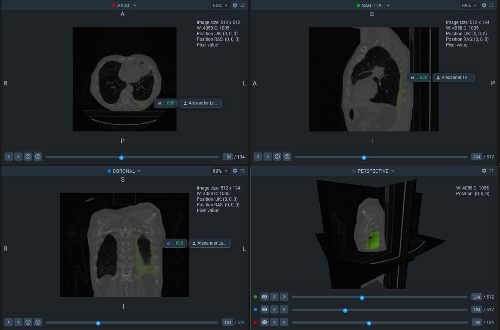

# pleural_effusion_segmentation

A repository used to train [pleural effusion](https://en.wikipedia.org/wiki/Pleural_effusion) segmentation model. 
Example of object you can see in [Supervisely](https://supervise.ly/) project 
[here](https://app.supervise.ly/share-links/CLaWf6xh1Fkwrqqj1WOw1b5pzr2q4gYnIiVnEl7mIooZzGq9PNesu01o431Sp16b).



## Installation

If you want to train model, run in terminal code below:
```
git clone https://github.com/JI411/pleural_effusion_segmentation.git
cd pleural_effusion_segmentation
pip install -r requirements.txt
python download_dataset.py
python run.py --accelerator="gpu" --max_epochs=100
```

You can specify run with pytorch-lightning params, see examples [here](https://pytorch-lightning.readthedocs.io/en/stable/common/trainer.html#trainer-in-python-scripts)

## Contributing

Install libraries from `requirements-dev.txt`, run pytest and pylint 
(disabled checks can be found in [pylint.yml](https://github.com/JI411/pleural_effusion_segmentation/blob/main/.github/workflows/pylint.yml))
before push.


## TODO

### MVP
- [x] Project structure  
- [x] Dataset downloading script
- [x] Dice loss
- [x] Pylint & actions
- [x] Logging
- [x] 2D dataset for pleural effusion
- [x] Unet model from smp
- [x] Visualisation with [Supervisely](https://supervise.ly/) 
- [x] Preprocessing & augmentations  
- [ ] Augmentations from config
- [ ] Use Supervisely dataset format
- [x] Train script
- [x] Dataset caching
- [ ] Add models from [MedicalZooPytorch](https://github.com/black0017/MedicalZooPytorch)

## Next 
- [ ] 3D dataset 
- [ ] Unet3D model
